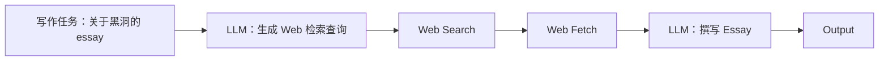

Date 0323
如何把AI的私有化数据转为标准MCP模型 

Goal
- Drive a disciplined development process, specifcically one focused on evals and error analysis
- 

Agentic AI workflows: An agentic AI workflow is a process where LLM-based app executes multiple steps to complete a task

Research Agent: ??? TO build ??

> The degree to which agentic workflows can be autonomous. 
Degree of autonomy:

（线性流程：`写作任务 → LLM(检索查询) → Web Search → Web Fetch → LLM(成文) → 输出`）

