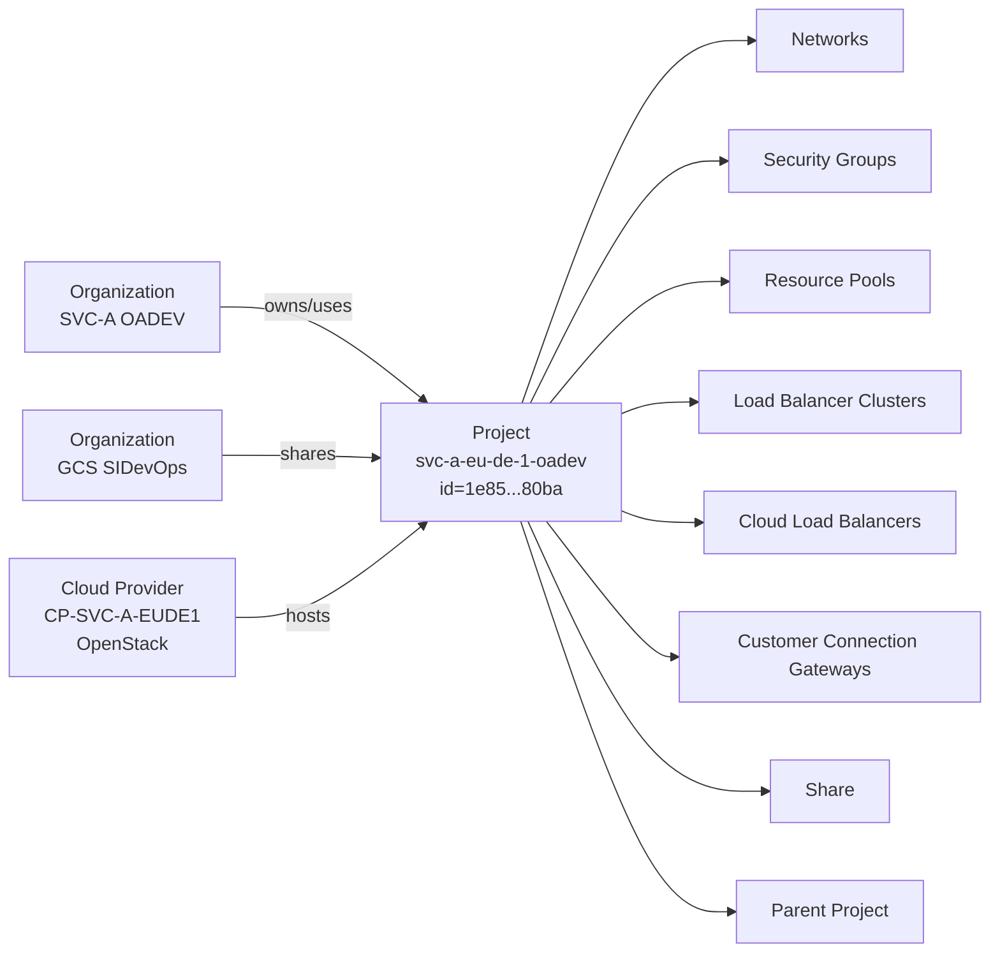

```mermaid
flowchart LR
    Org1[Organization<br/>SVC-A OADEV]
    Org2[Organization<br/>GCS SIDevOps]
    CP[Cloud Provider<br/>CP-SVC-A-EUDE1<br/>OpenStack]
    Proj[Project<br/>svc-a-eu-de-1-oadev<br/>id=1e85...80ba]

    Net[Networks]
    SG[Security Groups]
    RP[Resource Pools]
    LBC[Load Balancer Clusters]
    CLB[Cloud Load Balancers]
    CCG[Customer Connection Gateways]
    Share[Share]
    Parent[Parent Project]

    Org1 -->|owns/uses| Proj
    Org2 -->|shares| Proj
    CP -->|hosts| Proj

    Proj --> Net
    Proj --> SG
    Proj --> RP
    Proj --> LBC
    Proj --> CLB
    Proj --> CCG
    Proj --> Share
    Proj --> Parent
```