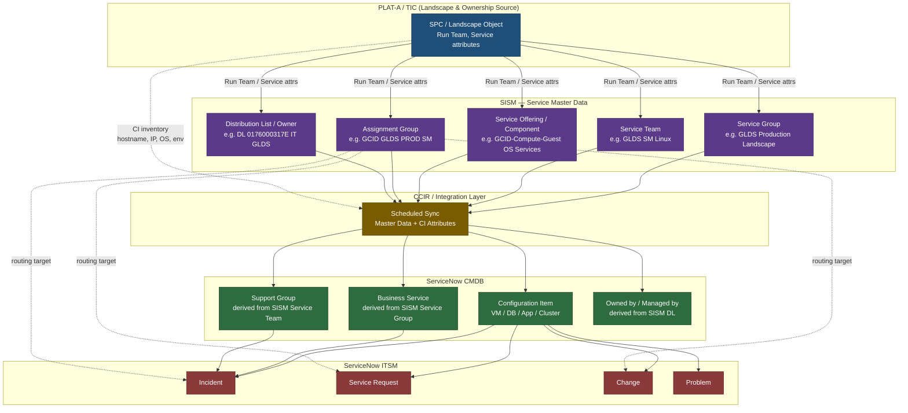
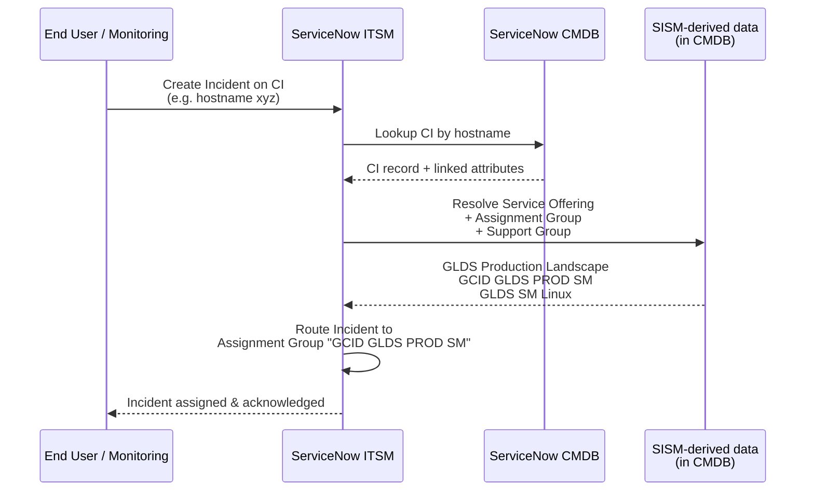
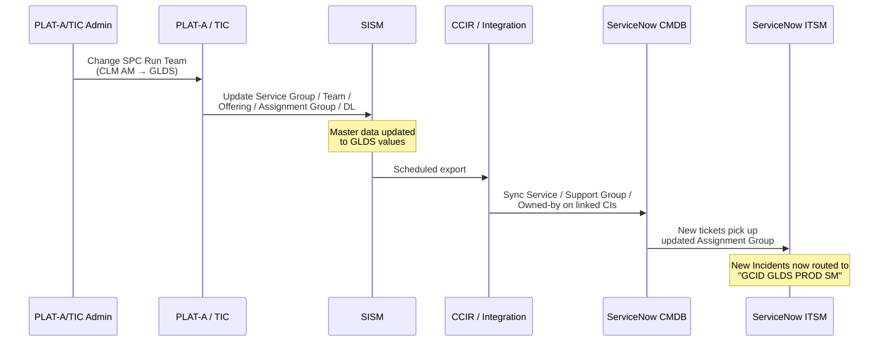

# SISM → CMDB → ServiceNow ITSM Flow Diagram

## End-to-End Data & Routing Flow

---

## Sequence View — Ticket Routing at Runtime

---

## Sync View — Ownership Transfer Propagation

---

## Layer Responsibilities (Quick Reference)

| Layer | Role | Key Entities |
|---|---|---|
| **PLAT-A / TIC** | Landscape & ownership source | SPC, Run Team, hostnames, IPs |
| **SISM** | Service master data (authoritative for ownership) | Service Group, Service Team, Service Offering, Assignment Group, DL |
| **CCIR / Integration** | Sync conduit | Scheduled jobs, transformations |
| **ServiceNow CMDB** | CI inventory + linked service/ownership | CI, Business Service, Support Group, Owned-by |
| **ServiceNow ITSM** | Operational ticketing | Incident, Request, Change, Problem |

---

If you'd like, I can also produce:
- A **swimlane diagram** showing failure points when SISM and CMDB drift out of sync
- A **C4 container diagram** for architecture documentation
- The same flow rendered specifically for the **CLM AM → GLDS transfer** scenario

Just let me know which format would be most useful.