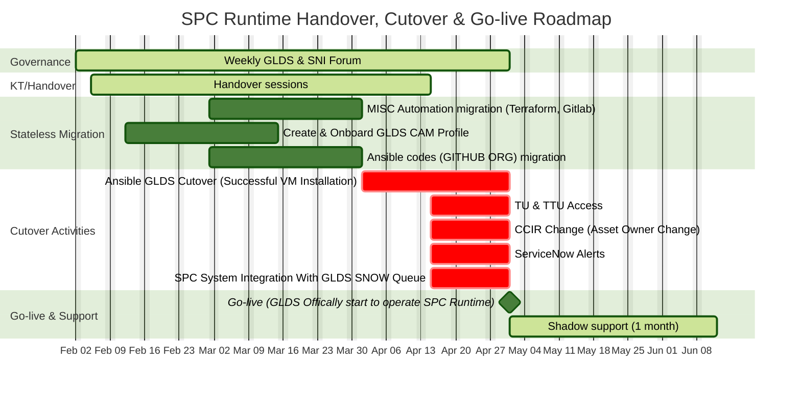

https://mermaid.ai/docs/mermaid-oss/syntax/gantt.html#section-statements

https://mermaid.ai/app/projects/00000000-0000-4000-8000-000000000001/diagrams/00000000-0000-4000-8000-000000000002/version/v0.1/edit 

https://mermaid.ai/docs/mermaid-oss/syntax/gantt.html#gantt-diagrams 
https://mermaid.ai/app/projects/00000000-0000-4000-8000-000000000001/diagrams/00000000-0000-4000-8000-000000000002/version/v0.1/edit 

