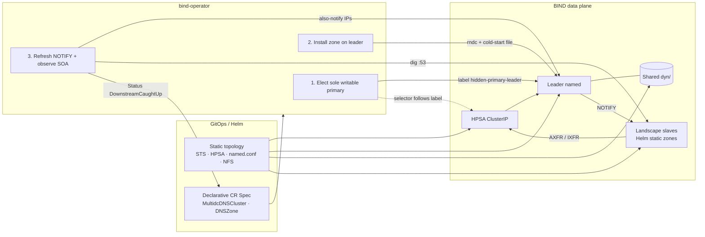

import Drawio from '@theme/Drawio'
import dnsDesign from '!!raw-loader!./DNS_K8S_Solution.drawio'

# Running HA DNS Service in Kubernetes

Architecture for operating a highly available DNS service on Kubernetes.
The diagram below is rendered from the `.drawio` source — zoom, toggle layers, and open fullscreen via lightbox.

<Drawio
  content={dnsDesign}
  toolbar="zoom layers lightbox"
  maxHeight={900}
/>

## Operator design — MultidcDNSCluster (single dynamic zone)

### Core design (four invariants)

1. **Two planes:** Helm installs the static topology once. The operator only converges state that keeps changing after install (who is writable, whether the zone is on the leader, NOTIFY targets, whether downstreams caught up). The operator does **not** create StatefulSets/Services and does **not** send `rndc` to landscape slaves.
2. **Single writer:** At most one master carries `hidden-primary-leader` at any time. HPSA write ingress and downstream AXFR both target this Service — never a hard-coded Pod name. Failover must **flush the journal to shared NFS, `addzone` on the new primary, then retag**; if promote fails, do not move traffic.
3. **Zone lives on the leader:** A `DNSZone` Spec is identity plus a cold-start SOA/NS skeleton. Live serial and record content belong to BIND. Materialize `dyn/<zone>.zone` only on cold start; never overwrite an existing file. Deleting the CR ≠ unloading BIND; unload requires an explicit annotation.
4. **NOTIFY follows Pod IPs; convergence watches serial:** Landscape zone definitions stay with landscape Helm (`masters` → HPSA). The operator only writes Ready slave Pod IPs into the master's `also-notify`, then compares SOA serials via UDP/53 `dig`, and records `DownstreamCaughtUp`.

### Three primary flows

1. **Install:** Helm brings up Master STS, HPSA, NFS, Lease shell, and initial CRs → `MultidcDNSClusterReconciler` ensures the Lease exists and aggregates Pod Status → `LeaderController` elects a Ready master and applies the label → HPSA has Endpoints.
2. **Zone lifecycle:** Create `DNSZone` → wait for `status.leader.podIP` → PodExec write file if needed → `rndc modzone/addzone` → refresh `also-notify` → `dig` SOA into Status. Unload: annotation `unload-from-leader` → `delzone` on the leader only; NFS files are retained.
3. **Failover:** Current leader NotReady → pick next Ready master by name → old primary freeze/sync/`delzone` (failures do not block) → new primary `addzone` from NFS → **only on success** strip old label, apply new label, write `status.leader` → `DNSZone` requeues on leader change and re-applies zone / `also-notify` on the new IP.
