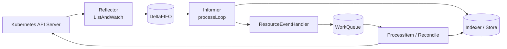

# client-go Controller 架构 Flow

本文按 **1. 2. 3. …** 逐行拆解 [sample-controller: client-go under the hood](https://github.com/kubernetes/sample-controller/blob/master/docs/controller-client-go.md) 中的架构交互。机制主要位于 [client-go/tools/cache](https://github.com/kubernetes/client-go/tree/master/tools/cache)。

官方示意图：

---

## 一、client-go 侧组件 Flow

### 1. Reflector — 盯住 API，把变更推进队列

1. Reflector（`cache.Reflector`，见 [reflector.go](https://github.com/kubernetes/client-go/blob/master/tools/cache/reflector.go)）对指定 **resource type / kind** 建立监听。
2. 核心方法是 **ListAndWatch**：先 List 全量，再 Watch 增量；对象可以是内置资源，也可以是 Custom Resource。
3. Watch 通知有新实例后，在 **watchHandler** 里取到对象，写入 **DeltaFIFO** 队列，供下游消费。

### 2. Informer — 从 DeltaFIFO 弹出对象并驱动后续

1. Informer 定义在 cache 包的 base controller（见 [controller.go](https://github.com/kubernetes/client-go/blob/master/tools/cache/controller.go)）。
2. **processLoop** 从 DeltaFIFO **弹出**对象。
3. 职责有两件：把对象**存起来**供稍后检索；再**回调**你的 Controller，把对象交出去。

### 3. Indexer — 本地索引与线程安全 Store

1. Indexer（`cache.Indexer`，见 [index.go](https://github.com/kubernetes/client-go/blob/master/tools/cache/index.go)）在本地对象上提供索引能力。
2. 典型场景：按 **labels** 建索引；可同时挂多套 indexing functions。
3. 底层是线程安全的 Store；默认 **MetaNamespaceKeyFunc**（见 [store.go](https://github.com/kubernetes/client-go/blob/master/tools/cache/store.go)）生成 key：`<namespace>/<name>`。

---

## 二、Custom Controller 侧组件 Flow

### 4. Informer reference — 你持有的 Informer 句柄

1. 这是知道如何处理**你的 CR / 目标资源**的 Informer 引用。
2. Custom Controller 代码必须自己创建合适的 Informer。
3. 后续事件投递、本地缓存同步，都依赖这个引用。

### 5. Indexer reference — 处理时按 key 取对象

1. 这是对应资源的 Indexer 引用。
2. Controller 创建它之后，在 reconcile / process 阶段用它 **Get / List** 最新本地对象。
3. 与 Informer 通常成对出现：一边收事件，一边读缓存。

> client-go base controller 提供 **NewIndexerInformer** 同时创建两者。你可以 [直接调用](https://github.com/kubernetes/client-go/blob/master/examples/workqueue/main.go#L174)，或像 [sample-controller main.go](https://github.com/kubernetes/sample-controller/blob/master/main.go#L61) 那样用 factory。

### 6. Resource Event Handlers — Informer 回调到你的 Controller

1. Informer 要把对象交给 Controller 时，调用你注册的 **Add / Update / Delete** handlers。
2. 常见写法：从对象算出 **key**，不要在 handler 里做重活。
3. 把 key **enqueue** 到 WorkQueue，把「送达」和「处理」解耦。

### 7. WorkQueue — 解耦投递与处理

1. WorkQueue 由你在 Controller 代码里创建。
2. Event Handler 只负责：提取 key → `Add` / `AddRateLimited` 入队。
3. 真正的业务逻辑在 worker 里异步消费，避免阻塞 Informer 循环。

### 8. Process Item — 出队、取对象、收敛期望态

1. 你实现从 WorkQueue **取出 key** 的 process 函数（可有多个 worker）。
2. 用 **Indexer reference**（或 List wrapper）按 key 取回对象。
3. 执行实际处理（对比期望态 / 调 API / 写 Status）；失败可再入队重试。

---

## 三、端到端串起来（一次变更的完整路径）

1. **API Server** 上对象变化 → Reflector `ListAndWatch` 感知。
2. Reflector 写入 **DeltaFIFO** → Informer `processLoop` 弹出 → 更新 **Indexer**，并触发 **ResourceEventHandler**。
3. Handler 只入队 **key** → worker **ProcessItem** 从 Indexer 取对象 → 调 API 收敛 → 完成一次 reconcile。

---

## 参考

- [client-go under the hood（sample-controller）](https://github.com/kubernetes/sample-controller/blob/master/docs/controller-client-go.md)
- [client-go](https://github.com/kubernetes/client-go/)
- [tools/cache](https://github.com/kubernetes/client-go/tree/master/tools/cache)
