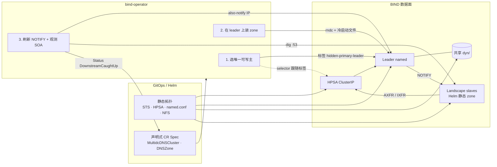

import Drawio from '@theme/Drawio'
import dnsDesign from '!!raw-loader!@site/docs/Solution_Architect/DNS/DNS_K8S_Solution.drawio'

# 在 Kubernetes 上运行 HA DNS 服务

在 Kubernetes 上运行高可用 DNS 服务的架构说明。
下方图表由 `.drawio` 源文件直接渲染，可缩放、切换图层，并在 lightbox 中全屏查看。

<Drawio
  content={dnsDesign}
  toolbar="zoom layers lightbox"
  maxHeight={900}
/>

## Operator 设计 — MultidcDNSCluster（单动态 Zone 场景）

### 核心设计（四条不变量）

1. **双平面：** Helm 只装一次静态拓扑；Operator 只收敛「安装之后还在变」的状态（谁可写、zone 是否在 leader 上、NOTIFY 目标、下游是否追上）。Operator 不创建 STS/Service，不对 landscape 发 `rndc`。
2. **单写者：** 任意时刻最多一个 master 带 `hidden-primary-leader`。HPSA 的写入口和下游 AXFR 都打这个 Service，不绑死某个 Pod 名。切换必须 **先把 journal 落到共享 NFS、新主 `addzone`，再改标签**；promote 失败则不切流量。
3. **Zone 在 leader：** `DNSZone` Spec 是身份 + 冷启动 SOA/NS 骨架。Live serial / 记录内容属于 BIND。冷启动才物化 `dyn/<zone>.zone`；文件已在则绝不覆盖。删 CR ≠ 卸 BIND；卸 zone 靠显式注解。
4. **NOTIFY 跟 IP、收敛看 serial：** landscape zone 定义归 landscape Helm（`masters` → HPSA）。Operator 只把 Ready slave PodIP 写进 master 侧 `also-notify`，再用 UDP/53 `dig` 比较 serial，写入 `DownstreamCaughtUp`。

### 三条主流程

1. **安装：** Helm 拉起 Master STS、HPSA、NFS、Lease 壳、初始 CR → `MultidcDNSClusterReconciler` 保证 Lease 存在并汇总 Pod Status → `LeaderController` 选出 Ready master、打标签 → HPSA 有 Endpoint。
2. **Zone 生命周期：** 创建 `DNSZone` → 等 `status.leader.podIP` → 必要时 PodExec 写文件 → `rndc modzone/addzone` → 刷 `also-notify` → `dig` SOA 写 Status。卸载：注解 `unload-from-leader` → 仅 leader `delzone`，NFS 文件保留。
3. **Failover：** 当前 leader NotReady → 按名字选下一个 Ready master → 旧主 freeze/sync/`delzone`（失败不阻塞）→ 新主从 NFS `addzone` → **成功才** 剥旧标签、打新标签、写 `status.leader` → DNSZone 因 leader 变化入队，在新 IP 上再 apply zone / `also-notify`。
